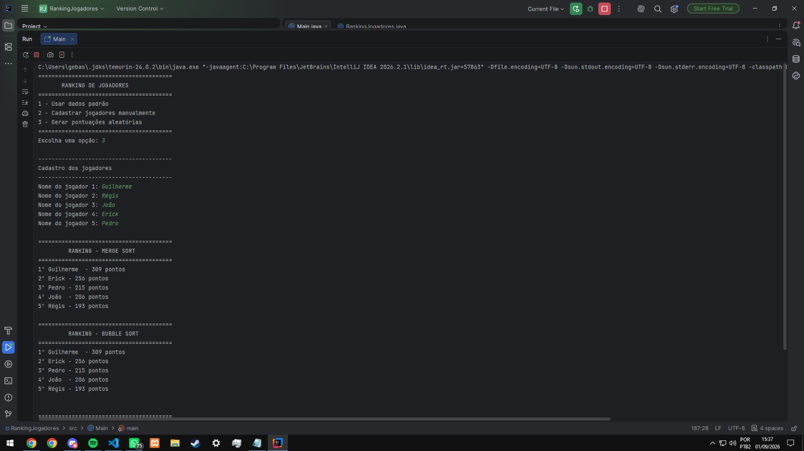

# AP1 — Ranking de Jogadores

**Alunos:** Guilherme Bobsin - Régis Bopsin

---

Trabalho desenvolvido para a da disciplina de Algoritmos e Estruturas de Dados.

O projeto consiste em um sistema simples de ranking de jogadores, utilizando vetores, matrizes e algoritmos de ordenação em Java.

O sistema possui 5 jogadores e 4 rodadas, permitindo cadastrar jogadores, utilizar dados padrão ou gerar pontuações aleatórias. Ao final, os jogadores são organizados de acordo com sua pontuação total.

---

## Justificativas

### 1. Quais dois algoritmos foram escolhidos?

Foram escolhidos os algoritmos Merge Sort e Bubble Sort.

### 2. Qual utiliza Divisão e Conquista?

O Merge Sort utiliza a estratégia de divisão e conquista, pois divide o conjunto de dados em partes menores, ordena cada parte separadamente e depois combina essas partes para formar o resultado final.

### 3. Por que escolheram esses dois algoritmos?

Escolhemos estes dois pois possuem formas diferentes de realizar a ordenação. O Bubble Sort é mais simples, enquanto o Merge Sort utiliza uma estratégia mais eficiente de ordenação.

### 4. Qual escolheriam para milhares de jogadores?

Para milhares de jogadores, escolheríamos o Merge Sort, pois ele possui um desempenho mais eficiente para grandes quantidades de dados, enquanto o Bubble Sort pode ficar muito lento conforme o número de jogadores aumenta, o Merge Sort acaba sendo mais eficiente.

## Resultado

